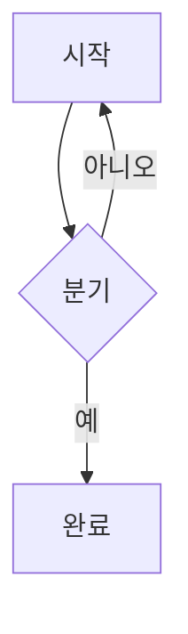
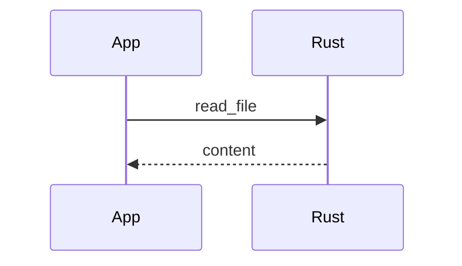

# mermaid 다이어그램 렌더링 구현 계획

> **For agentic workers:** REQUIRED SUB-SKILL: Use superpowers:subagent-driven-development (recommended) or superpowers:executing-plans to implement this plan task-by-task. Steps use checkbox (`- [ ]`) syntax for tracking.

**Goal:** \`\`\`mermaid 코드펜스를 GitHub처럼 SVG 다이어그램으로 렌더한다 (스펙: `docs/superpowers/specs/2026-06-12-mermaid-rendering-design.md`).

**Architecture:** remark-rehype의 `handlers.code` 오버라이드가 mermaid 펜스만 `<pre>` 래퍼 없는 `<mermaid-block code="...">` hast 엘리먼트로 직접 변환해 shiki를 우회시키고(그 외 펜스는 `defaultHandlers.code` 위임으로 기존과 동일), react-markdown의 `components` 매핑(useMemo로 참조 고정)이 이를 `MermaidDiagram` 컴포넌트로 렌더한다. 비동기 `mermaid.render`는 컴포넌트 내부에 격리되어 동기 `<Markdown>` 제약과 충돌하지 않는다. OS 컬러 스킴 추종·에러 표시·stale 렌더 무시는 컴포넌트의 상태기계가 담당한다.

**Tech Stack:** mermaid 11.x (dynamic import), mdast-util-to-hast (defaultHandlers), 기존 react-markdown 10 + @shikijs/rehype 파이프라인, vitest 4 (node/jsdom projects), TDD with DI (모킹 금지).

**사전 검증 (2026-06-12, 계획 작성 중 실제 설치 패키지로 스파이크 2회 + 다중 에이전트 적대적 리뷰 9에이전트 수행):**
- `remarkRehypeOptions.handlers.code` 오버라이드로 만든 bare `<mermaid-block>`이 rehypeRaw(raw HTML 동반)·shiki·blockquote 중첩을 모두 통과해 `components` 매핑에 `code` prop 원문(개행·따옴표·HTML 특수문자 포함) 그대로, **`<pre>` 조상 없이** 도달한다. react-markdown은 사용자 `remarkRehypeOptions`에 `allowDangerousHtml: true`를 병합하므로 rehypeRaw도 정상 동작한다.
- 초안의 "remark 플러그인 + `data.hName`" 방식은 **기각됨** — mdast-util-to-hast의 code 핸들러는 hName을 내부 엘리먼트에 적용한 뒤 무조건 `<pre>`로 감싸서, 다이어그램이 github-markdown-css의 코드박스 안에 갇힌다 (리뷰에서 발견, 재현으로 확정).
- `components` 객체를 **useMemo로 참조 고정**하면 source 변경 rerender에서도 매핑된 컴포넌트가 remount되지 않는다(mount 카운트 실험으로 확인). 인라인 매핑은 렌더마다 element type identity가 바뀌어 모든 MermaidDiagram이 remount(SVG 소실·깜빡임)되므로 **금지** — 스펙 §2 "components 안정성" 결정.
- `declare module "react" { namespace JSX { interface IntrinsicElements } }` 선언 병합으로 type assertion 없이 `"mermaid-block"` 키가 `components`에서 타입 통과한다 (`tsc --noEmit` 무오류 확인).
- pnpm 격리 구조라 `mdast-util-to-hast`/`@types/mdast`/`@types/hast`는 직접 의존성 추가가 필수다.

**컨텍스트 (실행자가 알아야 할 것):**
- 이 저장소는 **pnpm 전용** (npm 금지). 현재 디렉터리는 이미 `feature/mermaid` 브랜치의 워크트리다 — 새 워크트리를 만들지 않는다.
- `<Markdown>`은 **동기 렌더**다. remark/rehype 플러그인에 비동기를 넣으면 크래시한다 (`src/lib/highlighter.ts` 상단 주석 참조). 이 계획의 비동기는 전부 MermaidDiagram 컴포넌트 내부에 있다.
- 테스트 규칙: 모킹 금지 — DI(기본값 있는 prop 주입)만 사용. vitest `globals: true`라 import 불필요. 설명은 한국어. `*.spec.ts` → node 환경, `*.spec.tsx` → jsdom 환경 (vitest.config.ts의 projects 분리).
- jsdom에는 `window.matchMedia`와 mermaid가 동작하지 않는다 — mermaid 관련 컴포넌트 테스트는 **반드시** DI로 fake를 주입한다.
- 코드 스타일: 함수 파라미터는 구조분해 객체 필수(서드파티가 시그니처를 정한 경우는 예외 — remark-rehype 핸들러의 `(state, node)`가 해당), type assertion·non-null assertion 금지, `else if` 금지(guard clause), export 함수는 파일 상단에 function 선언으로, 중괄호 없는 한 줄 제어문 금지. 커밋 시 lint-staged(oxfmt + oxlint)가 자동 실행된다.

---

### Task 1: 의존성 추가

**Files:**
- Modify: `package.json` (pnpm 명령으로 — 직접 편집하지 않는다)

- [ ] **Step 1: 런타임/타입 의존성 설치**

```bash
pnpm add mermaid mdast-util-to-hast
pnpm add -D @types/mdast @types/hast
```

Expected: `package.json`의 dependencies에 `mermaid`(^11.15.0), `mdast-util-to-hast`(^13.2.1), devDependencies에 `@types/mdast`, `@types/hast` 추가.

각 패키지의 역할:
- `mermaid` — 다이어그램 렌더러 (Task 2에서 dynamic import)
- `mdast-util-to-hast` — `defaultHandlers.code` 위임과 `State` 타입 (Task 5의 code 핸들러). 런타임에 react-markdown의 transitive 의존성으로 이미 존재하지만, pnpm 격리 구조에서 직접 import하려면 직접 의존성이어야 한다
- `@types/mdast` — code 핸들러의 `Code` 노드 타입 (Task 5)
- `@types/hast` — code 핸들러의 반환 `Element` 타입 (Task 5)

- [ ] **Step 2: 회귀 확인**

```bash
npx tsc --noEmit && pnpm test
```

Expected: tsc 무오류, 기존 테스트 전부 PASS (58개).

- [ ] **Step 3: Commit**

```bash
git add package.json pnpm-lock.yaml
git commit -m "chore: add mermaid rendering dependencies"
```

---

### Task 2: renderMermaidDiagram 기본 렌더 구현

**Files:**
- Create: `src/lib/renderMermaidDiagram.ts`
- Modify: `vitest.config.ts:12` (coverage exclude에 한 줄 추가)

MermaidDiagram의 DI 기본값이 될 실제 mermaid 호출 래퍼. **단위 테스트를 작성하지 않는다** — jsdom에서 mermaid는 SVG 측정이 필요해 동작하지 않으므로, `src/lib/installAppMenu.ts`(Tauri 전용이라 수동 검증)와 동일한 선례를 따라 coverage exclude + Task 6의 수동 검증으로 커버한다 (스펙 §4 비목표).

- [ ] **Step 1: 구현 작성**

`src/lib/renderMermaidDiagram.ts`:

```typescript
/**
 * @fileoverview MermaidDiagram의 기본 렌더 구현입니다(DI 기본값).
 * mermaid(~2MB)는 dynamic import로 청크를 분리해 mermaid 펜스가 없는 문서에는 로드 비용이 없습니다(스펙 §2).
 * 렌더 직전 initialize({ theme })를 매번 호출하는 것이 mermaid의 공식 테마 전환 방법입니다.
 * suppressErrorRendering: true는 문법 오류 시 mermaid가 DOM에 직접 꽂는 에러 SVG를 차단합니다(에러 UI는 MermaidDiagram 담당).
 * jsdom에서 mermaid가 동작하지 않아(SVG 측정 필요) 단위 테스트 대신 수동 검증으로 커버합니다 — installAppMenu와 동일하게 coverage exclude (스펙 §4).
 */
export type MermaidTheme = "default" | "dark";

export type RenderMermaidDiagramParams = {
  /** mermaid가 내부 임시 엘리먼트에 쓰는 고유 id (DOM id 규칙을 따라야 한다) */
  id: string;
  /** mermaid 다이어그램 원문 */
  code: string;
  /** 라이트면 "default", 다크면 "dark" */
  theme: MermaidTheme;
};

export async function renderMermaidDiagram({
  id,
  code,
  theme,
}: RenderMermaidDiagramParams): Promise<{ svg: string }> {
  const { default: mermaid } = await import("mermaid");
  mermaid.initialize({
    startOnLoad: false,
    suppressErrorRendering: true,
    theme,
  });
  const { svg } = await mermaid.render(id, code);
  return { svg };
}
```

- [ ] **Step 2: coverage exclude 추가**

`vitest.config.ts`의 `coverage.exclude` 배열 끝에 `'src/lib/renderMermaidDiagram.ts'`를 추가:

```typescript
      exclude: ['src/**/*.spec.{ts,tsx}', 'src/main.tsx', 'src/vite-env.d.ts', 'src/**/*.d.ts', 'src/lib/installAppMenu.ts', 'src/lib/renderMermaidDiagram.ts'],
```

- [ ] **Step 3: 타입·린트 확인**

```bash
npx tsc --noEmit && pnpm lint && pnpm test
```

Expected: 모두 통과. (mermaid의 `MermaidConfig`에 `suppressErrorRendering`이 없다는 타입 오류가 나오면 mermaid 버전이 11 미만으로 설치된 것 — `pnpm why mermaid`로 확인.)

- [ ] **Step 4: Commit**

```bash
git add src/lib/renderMermaidDiagram.ts vitest.config.ts
git commit -m "feat: add renderMermaidDiagram default renderer"
```

---

### Task 3: MermaidDiagram 컴포넌트 — 렌더 상태기계

**Files:**
- Create: `src/components/MermaidDiagram.tsx`
- Test: `src/components/MermaidDiagram.spec.tsx`

상태기계: `pending`(원본 코드 표시) → `rendered`(SVG 표시) / `error`(에러 메시지 + 원본 코드). 컬러 스킴은 구독 DI로 받는다 — **구독 계약: 구독 즉시 현재 값을 동기로 1회 전달하고, 이후 변경마다 전달** (스펙 §3.2). 초기 `isDark`를 `null`로 두고 구독이 값을 줄 때까지 렌더를 시작하지 않아, 잘못된 테마로 한 번 렌더하고 버리는 낭비를 없앤다.

- [ ] **Step 1: 실패하는 테스트 작성 (기본 상태기계 5케이스 + 헬퍼)**

`src/components/MermaidDiagram.spec.tsx`:

```tsx
import { act, render, screen } from "@testing-library/react";
import type { RenderMermaidDiagramParams } from "../lib/renderMermaidDiagram";
import { type ColorSchemeSubscriber, MermaidDiagram } from "./MermaidDiagram";

const context = describe;

describe("MermaidDiagram", () => {
  context("렌더가 완료되기 전인 경우", () => {
    test("원본 코드를 코드블록으로 표시합니다.", () => {
      const renderer = createManualRenderer();
      const colorScheme = createFakeColorScheme({ isDark: false });
      const { container } = render(
        <MermaidDiagram
          code={"graph TD\n  A --> B"}
          renderDiagram={renderer.renderDiagram}
          subscribeColorScheme={colorScheme.subscribe}
        />,
      );

      expect(container.querySelector("pre code")).toHaveTextContent("A --> B");
      expect(container.querySelector("svg")).toBeNull();
    });
  });

  context("렌더에 성공한 경우", () => {
    test("SVG를 표시하고 원본 코드블록을 제거합니다.", async () => {
      const renderer = createManualRenderer();
      const colorScheme = createFakeColorScheme({ isDark: false });
      const { container } = render(
        <MermaidDiagram
          code={"graph TD"}
          renderDiagram={renderer.renderDiagram}
          subscribeColorScheme={colorScheme.subscribe}
        />,
      );

      const [firstCall] = renderer.calls;
      await act(async () => {
        firstCall.resolve({
          svg: '<svg role="img" aria-label="다이어그램"></svg>',
        });
      });

      expect(
        screen.getByRole("img", { name: "다이어그램" }),
      ).toBeInTheDocument();
      expect(container.querySelector("pre code")).toBeNull();
    });

    test("renderDiagram에 코드 원문·라이트 테마·고유 id를 전달합니다.", () => {
      const renderer = createManualRenderer();
      const colorScheme = createFakeColorScheme({ isDark: false });
      render(
        <MermaidDiagram
          code={"graph TD"}
          renderDiagram={renderer.renderDiagram}
          subscribeColorScheme={colorScheme.subscribe}
        />,
      );

      expect(renderer.calls).toHaveLength(1);
      const [firstCall] = renderer.calls;
      expect(firstCall.code).toBe("graph TD");
      expect(firstCall.theme).toBe("default");
      expect(firstCall.id).not.toBe("");
    });
  });

  context("렌더에 실패한 경우", () => {
    test("에러 메시지와 원본 코드를 함께 표시합니다.", async () => {
      const renderer = createManualRenderer();
      const colorScheme = createFakeColorScheme({ isDark: false });
      const { container } = render(
        <MermaidDiagram
          code={"graph TD"}
          renderDiagram={renderer.renderDiagram}
          subscribeColorScheme={colorScheme.subscribe}
        />,
      );

      const [firstCall] = renderer.calls;
      await act(async () => {
        firstCall.reject(new Error("Parse error on line 1"));
      });

      expect(screen.getByRole("alert")).toHaveTextContent(
        "Parse error on line 1",
      );
      expect(container.querySelector("pre code")).toHaveTextContent("graph TD");
    });

    test("이후 렌더가 성공하면 에러 표시를 해제합니다.", async () => {
      const renderer = createManualRenderer();
      const colorScheme = createFakeColorScheme({ isDark: false });
      render(
        <MermaidDiagram
          code={"graph TD"}
          renderDiagram={renderer.renderDiagram}
          subscribeColorScheme={colorScheme.subscribe}
        />,
      );

      const [firstCall] = renderer.calls;
      await act(async () => {
        firstCall.reject(new Error("Parse error"));
      });
      expect(screen.getByRole("alert")).toBeInTheDocument();

      // 컬러 스킴 변경으로 재렌더를 트리거한다
      act(() => {
        colorScheme.emit({ isDark: true });
      });
      const [, secondCall] = renderer.calls;
      await act(async () => {
        secondCall.resolve({
          svg: '<svg role="img" aria-label="복구된 다이어그램"></svg>',
        });
      });

      expect(
        screen.getByRole("img", { name: "복구된 다이어그램" }),
      ).toBeInTheDocument();
      expect(screen.queryByRole("alert")).not.toBeInTheDocument();
    });
  });
});

type ManualRenderCall = RenderMermaidDiagramParams & {
  resolve: (args: { svg: string }) => void;
  reject: (reason: unknown) => void;
};

/** 테스트가 완료 시점을 직접 제어하는 renderDiagram fake */
function createManualRenderer() {
  const calls: ManualRenderCall[] = [];
  function renderDiagram({
    id,
    code,
    theme,
  }: RenderMermaidDiagramParams): Promise<{ svg: string }> {
    return new Promise((resolve, reject) => {
      calls.push({ id, code, theme, resolve, reject });
    });
  }
  return { calls, renderDiagram };
}

/** 구독 즉시 현재 값을 동기 1회 전달하는 컬러 스킴 fake (스펙 §3.2 계약) */
function createFakeColorScheme({ isDark }: { isDark: boolean }) {
  let current = isDark;
  const listeners = new Set<(args: { isDark: boolean }) => void>();
  const subscribe: ColorSchemeSubscriber = ({ onChange }) => {
    listeners.add(onChange);
    onChange({ isDark: current });
    return () => {
      listeners.delete(onChange);
    };
  };
  return {
    subscribe,
    getListenerCount: () => listeners.size,
    emit: ({ isDark: nextIsDark }: { isDark: boolean }) => {
      current = nextIsDark;
      for (const listener of listeners) {
        listener({ isDark: nextIsDark });
      }
    },
  };
}
```

- [ ] **Step 2: 테스트 실패 확인**

```bash
pnpm vitest run src/components/MermaidDiagram.spec.tsx
```

Expected: FAIL — `Cannot find module './MermaidDiagram'` 류의 모듈 없음 오류.

- [ ] **Step 3: 컴포넌트 구현**

`src/components/MermaidDiagram.tsx`:

```tsx
import { useEffect, useState } from "react";
import {
  type MermaidTheme,
  type RenderMermaidDiagramParams,
  renderMermaidDiagram,
} from "../lib/renderMermaidDiagram";

export type ColorSchemeSubscriber = (args: {
  onChange: (args: { isDark: boolean }) => void;
}) => () => void;

type DiagramState =
  | { status: "pending" }
  | { status: "rendered"; svg: string }
  | { status: "error"; message: string };

type MermaidDiagramProps = {
  /** mermaid 다이어그램 원문 */
  code: string;
  /** 다이어그램 렌더 함수 — jsdom에서 mermaid가 동작하지 않아 테스트에서 주입
   * @default renderMermaidDiagram
   */
  renderDiagram?: (
    args: RenderMermaidDiagramParams,
  ) => Promise<{ svg: string }>;
  /** OS 컬러 스킴 구독 — 구독 즉시 현재 값을 동기 1회 전달 후 변경마다 전달
   * @default matchMedia("(prefers-color-scheme: dark)") 래퍼
   */
  subscribeColorScheme?: ColorSchemeSubscriber;
};

export function MermaidDiagram({
  code,
  renderDiagram = renderMermaidDiagram,
  subscribeColorScheme = subscribeToPrefersDark,
}: MermaidDiagramProps) {
  // null = 구독이 초기값을 주기 전 — 잘못된 테마로 렌더했다 버리는 것을 방지
  const [isDark, setIsDark] = useState<boolean | null>(null);
  const [diagram, setDiagram] = useState<DiagramState>({ status: "pending" });

  useEffect(() => {
    return subscribeColorScheme({
      onChange: ({ isDark: nextIsDark }) => {
        setIsDark(nextIsDark);
      },
    });
  }, [subscribeColorScheme]);

  useEffect(() => {
    if (isDark === null) {
      return;
    }
    const theme: MermaidTheme = isDark ? "dark" : "default";
    renderDiagram({ id: nextDiagramId(), code, theme }).then(
      ({ svg }) => {
        setDiagram({ status: "rendered", svg });
      },
      (error: unknown) => {
        setDiagram({ status: "error", message: String(error) });
      },
    );
  }, [code, isDark, renderDiagram]);

  if (diagram.status === "rendered") {
    return (
      <div
        className="mermaid-diagram"
        // mermaid의 산출물이 SVG 문자열이라 DOM 직접 삽입 외 방법이 없다
        dangerouslySetInnerHTML={{ __html: diagram.svg }}
      />
    );
  }
  return (
    <div className="mermaid-diagram">
      {diagram.status === "error" && (
        <p role="alert">mermaid 렌더 실패: {diagram.message}</p>
      )}
      <pre>
        <code>{code}</code>
      </pre>
    </div>
  );
}

let diagramSequence = 0;

// React useId()는 ":"를 포함해 mermaid 내부 selector와 충돌할 수 있어 모듈 카운터를 쓴다(스펙 §2)
function nextDiagramId(): string {
  diagramSequence += 1;
  return `mermaid-diagram-${diagramSequence}`;
}

function subscribeToPrefersDark({
  onChange,
}: {
  onChange: (args: { isDark: boolean }) => void;
}): () => void {
  const mediaQuery = window.matchMedia("(prefers-color-scheme: dark)");
  const handleChange = (event: MediaQueryListEvent) => {
    onChange({ isDark: event.matches });
  };
  mediaQuery.addEventListener("change", handleChange);
  onChange({ isDark: mediaQuery.matches });
  return () => {
    mediaQuery.removeEventListener("change", handleChange);
  };
}
```

주의: 이 단계에서는 stale 렌더 무시(cancelled 플래그)를 **아직 구현하지 않는다** — Task 4의 race 테스트가 그 필요성을 증명한 뒤 추가한다.

- [ ] **Step 4: 테스트 통과 확인**

```bash
pnpm vitest run src/components/MermaidDiagram.spec.tsx && npx tsc --noEmit
```

Expected: 5개 테스트 PASS, tsc 무오류.

- [ ] **Step 5: Commit**

```bash
git add src/components/MermaidDiagram.tsx src/components/MermaidDiagram.spec.tsx
git commit -m "feat: add MermaidDiagram component with render state machine"
```

---

### Task 4: MermaidDiagram — 재렌더·race·구독 해제

**Files:**
- Modify: `src/components/MermaidDiagram.tsx` (렌더 effect에 cancelled 플래그 추가)
- Test: `src/components/MermaidDiagram.spec.tsx` (테스트 추가)

스펙 §4의 "unmount 후 늦은 resolve가 setState 안 함" 케이스는 단독으로는 실패 조건을 정의할 수 없어(React는 경고만 출력) 테스트하지 않는다. 대신 동일한 코드 경로(cancelled 플래그)를 검증하는 race 테스트로 대체한다 — cleanup은 re-run과 unmount에서 같은 함수가 실행된다.

- [ ] **Step 1: 테스트 추가 (4케이스)**

`src/components/MermaidDiagram.spec.tsx`의 최상위 `describe("MermaidDiagram", ...)` 안, `context("렌더에 실패한 경우", ...)` 블록 뒤에 추가:

```tsx
  context("code가 변경된 경우", () => {
    test("새 code 인자로 다시 호출하고, 새 렌더가 끝날 때까지 이전 SVG를 유지하다가 교체합니다.", async () => {
      const renderer = createManualRenderer();
      const colorScheme = createFakeColorScheme({ isDark: false });
      const { rerender } = render(
        <MermaidDiagram
          code={"graph TD"}
          renderDiagram={renderer.renderDiagram}
          subscribeColorScheme={colorScheme.subscribe}
        />,
      );
      const [firstCall] = renderer.calls;
      await act(async () => {
        firstCall.resolve({
          svg: '<svg role="img" aria-label="이전 다이어그램"></svg>',
        });
      });

      rerender(
        <MermaidDiagram
          code={"graph LR"}
          renderDiagram={renderer.renderDiagram}
          subscribeColorScheme={colorScheme.subscribe}
        />,
      );

      // 새 렌더가 아직 완료되지 않음 — 이전 SVG가 유지된다 (깜빡임 방지, 스펙 §2)
      expect(
        screen.getByRole("img", { name: "이전 다이어그램" }),
      ).toBeInTheDocument();

      const [, secondCall] = renderer.calls;
      expect(secondCall.code).toBe("graph LR");
      await act(async () => {
        secondCall.resolve({
          svg: '<svg role="img" aria-label="새 다이어그램"></svg>',
        });
      });

      expect(
        screen.getByRole("img", { name: "새 다이어그램" }),
      ).toBeInTheDocument();
      expect(
        screen.queryByRole("img", { name: "이전 다이어그램" }),
      ).not.toBeInTheDocument();
    });

    test("취소된 이전 렌더가 늦게 완료되어도 결과를 무시합니다.", async () => {
      const renderer = createManualRenderer();
      const colorScheme = createFakeColorScheme({ isDark: false });
      const { rerender } = render(
        <MermaidDiagram
          code={"graph TD"}
          renderDiagram={renderer.renderDiagram}
          subscribeColorScheme={colorScheme.subscribe}
        />,
      );

      // 첫 렌더가 끝나기 전에 code가 바뀐다
      rerender(
        <MermaidDiagram
          code={"graph LR"}
          renderDiagram={renderer.renderDiagram}
          subscribeColorScheme={colorScheme.subscribe}
        />,
      );
      const [firstCall, secondCall] = renderer.calls;
      await act(async () => {
        secondCall.resolve({
          svg: '<svg role="img" aria-label="새 다이어그램"></svg>',
        });
      });

      // 취소됐어야 할 첫 렌더가 늦게 완료된다
      await act(async () => {
        firstCall.resolve({
          svg: '<svg role="img" aria-label="늦은 다이어그램"></svg>',
        });
      });

      expect(
        screen.getByRole("img", { name: "새 다이어그램" }),
      ).toBeInTheDocument();
      expect(
        screen.queryByRole("img", { name: "늦은 다이어그램" }),
      ).not.toBeInTheDocument();
    });
  });

  context("OS 컬러 스킴이 변경된 경우", () => {
    test("다크로 바뀌면 dark 테마로 다시 렌더합니다.", async () => {
      const renderer = createManualRenderer();
      const colorScheme = createFakeColorScheme({ isDark: false });
      render(
        <MermaidDiagram
          code={"graph TD"}
          renderDiagram={renderer.renderDiagram}
          subscribeColorScheme={colorScheme.subscribe}
        />,
      );

      act(() => {
        colorScheme.emit({ isDark: true });
      });

      expect(renderer.calls).toHaveLength(2);
      const [, secondCall] = renderer.calls;
      expect(secondCall.theme).toBe("dark");
    });
  });

  context("unmount된 경우", () => {
    test("컬러 스킴 구독을 해제합니다.", () => {
      const renderer = createManualRenderer();
      const colorScheme = createFakeColorScheme({ isDark: false });
      const { unmount } = render(
        <MermaidDiagram
          code={"graph TD"}
          renderDiagram={renderer.renderDiagram}
          subscribeColorScheme={colorScheme.subscribe}
        />,
      );
      expect(colorScheme.getListenerCount()).toBe(1);

      unmount();

      expect(colorScheme.getListenerCount()).toBe(0);
    });
  });
```

- [ ] **Step 2: race 테스트만 실패하는 것 확인**

```bash
pnpm vitest run src/components/MermaidDiagram.spec.tsx
```

Expected: "취소된 이전 렌더가 늦게 완료되어도 결과를 무시합니다." 1개만 FAIL ("늦은 다이어그램"이 표시됨), 나머지 8개 PASS.

- [ ] **Step 3: cancelled 플래그 구현**

`src/components/MermaidDiagram.tsx`의 렌더 effect를 다음으로 교체:

```tsx
  useEffect(() => {
    if (isDark === null) {
      return;
    }
    // code/테마 변경·unmount 후 늦게 도착하는 이전 렌더 결과를 무시한다
    let cancelled = false;
    const theme: MermaidTheme = isDark ? "dark" : "default";
    renderDiagram({ id: nextDiagramId(), code, theme }).then(
      ({ svg }) => {
        if (cancelled) {
          return;
        }
        setDiagram({ status: "rendered", svg });
      },
      (error: unknown) => {
        if (cancelled) {
          return;
        }
        setDiagram({ status: "error", message: String(error) });
      },
    );
    return () => {
      cancelled = true;
    };
  }, [code, isDark, renderDiagram]);
```

- [ ] **Step 4: 전체 테스트 통과 확인**

```bash
pnpm vitest run src/components/MermaidDiagram.spec.tsx && npx tsc --noEmit
```

Expected: 9개 테스트 전부 PASS, tsc 무오류.

- [ ] **Step 5: Commit**

```bash
git add src/components/MermaidDiagram.tsx src/components/MermaidDiagram.spec.tsx
git commit -m "feat: ignore stale mermaid render results and follow color scheme"
```

---

### Task 5: MarkdownView 파이프라인 연결

**Files:**
- Modify: `src/components/MarkdownView.tsx`
- Test: `src/components/MarkdownView.spec.tsx` (context 추가)

`remarkRehypeOptions.handlers.code` 오버라이드(비공개 함수 — export하지 않으므로 단위 spec 의무 없음, 통합 테스트가 행동을 고정) + `"mermaid-block"` components 매핑(useMemo로 참조 고정) + MermaidDiagram으로의 DI 통로(`mermaid?` prop). App.tsx는 수정하지 않는다 — prop이 옵셔널이라 프로덕션은 기본값(실제 mermaid + matchMedia)을 쓴다.

**경고:** components 객체를 useMemo 없이 인라인으로 만들면 MarkdownView가 재렌더될 때마다(저장·드래그 오버 등) 모든 MermaidDiagram이 remount되어 SVG가 소실된다 — 사전 검증에서 확정된 결함이며, Step 1의 마지막 테스트가 이 회귀를 잡는다.

- [ ] **Step 1: 실패하는 통합 테스트 작성 (4케이스 + 헬퍼)**

`src/components/MarkdownView.spec.tsx`의 import에 타입 추가:

```tsx
import type { RenderMermaidDiagramParams } from "../lib/renderMermaidDiagram";
```

최상위 `describe` 안, `context("코드 펜스가 포함된 경우", ...)` 블록 뒤에 추가:

```tsx
  context("mermaid 코드 펜스가 포함된 경우", () => {
    test("mermaid 펜스를 다이어그램으로 렌더하고 코드 원문을 전달합니다.", async () => {
      const receivedCodes: string[] = [];
      render(
        <MarkdownView
          source={"```mermaid\ngraph TD\n  A --> B\n```"}
          onLinkClick={noopLinkClick}
          mermaid={{
            renderDiagram: ({ code }) => {
              receivedCodes.push(code);
              return Promise.resolve({
                svg: '<svg role="img" aria-label="mermaid 다이어그램"></svg>',
              });
            },
            subscribeColorScheme: subscribeLightColorScheme,
          }}
        />,
      );

      expect(
        await screen.findByRole("img", { name: "mermaid 다이어그램" }),
      ).toBeInTheDocument();
      expect(receivedCodes).toEqual(["graph TD\n  A --> B"]);
    });

    test("다이어그램을 pre 코드박스 안에 렌더하지 않습니다.", async () => {
      render(
        <MarkdownView
          source={"```mermaid\ngraph TD\n```"}
          onLinkClick={noopLinkClick}
          mermaid={{
            renderDiagram: resolveNamedSvgDiagram,
            subscribeColorScheme: subscribeLightColorScheme,
          }}
        />,
      );

      const diagram = await screen.findByRole("img", {
        name: "mermaid 다이어그램",
      });
      // hName 방식의 결함(pre 래퍼 잔존) 회귀 검증 — 스펙 §2 가로채기 지점
      expect(diagram.closest("pre")).toBeNull();
    });

    test("mermaid 펜스가 있어도 다른 코드 펜스는 shiki가 하이라이팅합니다.", () => {
      const { container } = render(
        <MarkdownView
          source={
            "```mermaid\ngraph TD\n```\n\n```typescript\nconst answer = 42\n```"
          }
          onLinkClick={noopLinkClick}
          mermaid={{
            renderDiagram: neverResolveDiagram,
            subscribeColorScheme: subscribeLightColorScheme,
          }}
        />,
      );

      expect(container.querySelector("pre.shiki")).not.toBeNull();
      expect(container.querySelector("pre.shiki")).toHaveTextContent(
        "const answer = 42",
      );
    });

    test("source가 바뀌어도 같은 mermaid 펜스의 다이어그램은 유지하고 다시 렌더하지 않습니다.", async () => {
      const receivedCodes: string[] = [];
      // components remount 회귀 검증 — DI 객체는 rerender 간 참조가 안정적이어야 한다
      const stableMermaid = {
        renderDiagram: ({ code }: RenderMermaidDiagramParams) => {
          receivedCodes.push(code);
          return Promise.resolve({
            svg: '<svg role="img" aria-label="mermaid 다이어그램"></svg>',
          });
        },
        subscribeColorScheme: subscribeLightColorScheme,
      };
      const { rerender } = render(
        <MarkdownView
          source={"# v1\n\n```mermaid\ngraph TD\n```"}
          onLinkClick={noopLinkClick}
          mermaid={stableMermaid}
        />,
      );
      await screen.findByRole("img", { name: "mermaid 다이어그램" });

      rerender(
        <MarkdownView
          source={"# v2 바뀐 본문\n\n```mermaid\ngraph TD\n```"}
          onLinkClick={noopLinkClick}
          mermaid={stableMermaid}
        />,
      );

      // remount되면 pending으로 초기화되어 SVG가 사라지고 재호출이 발생한다 (스펙 §2 components 안정성)
      expect(
        screen.getByRole("img", { name: "mermaid 다이어그램" }),
      ).toBeInTheDocument();
      expect(receivedCodes).toHaveLength(1);
    });
  });
```

같은 파일 하단(기존 `noopLinkClick` 함수 아래)에 헬퍼 추가:

```tsx
function subscribeLightColorScheme({
  onChange,
}: {
  onChange: (args: { isDark: boolean }) => void;
}): () => void {
  onChange({ isDark: false });
  return () => {
    // 해제할 리소스가 없는 테스트용 구독자
  };
}

function resolveNamedSvgDiagram(): Promise<{ svg: string }> {
  return Promise.resolve({
    svg: '<svg role="img" aria-label="mermaid 다이어그램"></svg>',
  });
}

function neverResolveDiagram(): Promise<{ svg: string }> {
  return new Promise(() => {
    // 테스트가 끝날 때까지 의도적으로 완료하지 않는 렌더러
  });
}
```

- [ ] **Step 2: 테스트 실패 확인**

```bash
pnpm vitest run src/components/MarkdownView.spec.tsx
```

Expected: 새 테스트 4개 모두 FAIL (다이어그램 없음 / shiki 테스트는 mermaid 펜스가 text로 하이라이팅된 첫 pre.shiki를 잡아 텍스트 불일치). 기존 테스트는 PASS 유지. (vitest는 esbuild로 타입 체크 없이 트랜스파일하므로 `mermaid` prop 타입 오류로는 실패하지 않는다.)

- [ ] **Step 3: MarkdownView 수정**

`src/components/MarkdownView.tsx` 전체를 다음으로 교체:

```tsx
import type { RehypeShikiCoreOptions } from "@shikijs/rehype/core";
import rehypeShikiFromHighlighter from "@shikijs/rehype/core";
import type { Element } from "hast";
import type { Code } from "mdast";
import { defaultHandlers, type State } from "mdast-util-to-hast";
import { useMemo } from "react";
import Markdown, { type Options } from "react-markdown";
import rehypeRaw from "rehype-raw";
import remarkFrontmatter from "remark-frontmatter";
import remarkGfm from "remark-gfm";
import { highlighter } from "../lib/highlighter";
import type { RenderMermaidDiagramParams } from "../lib/renderMermaidDiagram";
import { type ColorSchemeSubscriber, MermaidDiagram } from "./MermaidDiagram";

// mermaidAwareCodeHandler가 만드는 커스텀 엘리먼트를 components 매핑이 type assertion 없이 받기 위한 선언 병합
declare module "react" {
  namespace JSX {
    interface IntrinsicElements {
      "mermaid-block": { code?: string };
    }
  }
}

const remarkPlugins: Options["remarkPlugins"] = [remarkGfm, remarkFrontmatter];

const shikiOptions = {
  themes: { light: "github-light", dark: "github-dark" },
  // light-dark() 인라인 색상 — :root { color-scheme: light dark }가 전제(Task 7의 App.css)
  defaultColor: "light-dark()",
  // 미지원 언어/언어 없는 펜스가 절대 throw하지 않게 하는 안전망
  fallbackLanguage: "text",
  defaultLanguage: "text",
  // 주의: lazy: true 금지 — 파이프라인이 비동기가 되어 동기 <Markdown>이 크래시한다
} satisfies RehypeShikiCoreOptions;

// 주의: rehypeRaw는 raw HTML 노드를 실제 hast 노드로 변환하므로 shiki보다 먼저 와야 한다
const rehypePlugins: Options["rehypePlugins"] = [
  rehypeRaw,
  [rehypeShikiFromHighlighter, highlighter, shikiOptions],
];

// mermaid 펜스만 <pre> 래퍼 없이 변환 — react-markdown이 allowDangerousHtml을 병합하므로 rehypeRaw와 공존한다
const remarkRehypeOptions: Options["remarkRehypeOptions"] = {
  handlers: { code: mermaidAwareCodeHandler },
};

type MermaidDependencies = {
  /** 다이어그램 렌더 함수 — jsdom에 mermaid가 없어 테스트에서 주입 */
  renderDiagram?: (
    args: RenderMermaidDiagramParams,
  ) => Promise<{ svg: string }>;
  /** OS 컬러 스킴 구독 — jsdom에 matchMedia가 없어 테스트에서 주입 */
  subscribeColorScheme?: ColorSchemeSubscriber;
};

type MarkdownViewProps = {
  /** 렌더할 마크다운 원문 */
  source: string;
  /** 본문 링크 클릭 시 호출 — App이 기본 브라우저 열기(openUrl)를 주입한다.
   * 주의: 참조가 안정적이어야 한다(components remount 방지) — App은 모듈 레벨 함수를 주입한다 */
  onLinkClick: (args: { url: string }) => void;
  /** MermaidDiagram에 전달할 DI — 프로덕션(App)은 기본값을 쓰므로 전달하지 않는다.
   * 주의: 전달한다면 참조가 안정적이어야 한다(components remount 방지) */
  mermaid?: MermaidDependencies;
};

export function MarkdownView({
  source,
  onLinkClick,
  mermaid,
}: MarkdownViewProps) {
  // components 참조가 렌더마다 바뀌면 매핑된 컴포넌트의 element type이 달라져
  // React가 모든 MermaidDiagram을 remount(SVG 소실·깜빡임)한다 — useMemo로 고정 (스펙 §2)
  const components = useMemo<Options["components"]>(
    () => ({
      a: ({ href, children }) => (
        <a
          href={href}
          onClick={(event) => {
            event.preventDefault();
            if (href === undefined) {
              return;
            }
            onLinkClick({ url: href });
          }}
        >
          {children}
        </a>
      ),
      "mermaid-block": ({ code }) => (
        <MermaidDiagram
          code={code ?? ""}
          renderDiagram={mermaid?.renderDiagram}
          subscribeColorScheme={mermaid?.subscribeColorScheme}
        />
      ),
    }),
    [onLinkClick, mermaid],
  );

  return (
    <article className="markdown-body">
      <Markdown
        remarkPlugins={remarkPlugins}
        rehypePlugins={rehypePlugins}
        remarkRehypeOptions={remarkRehypeOptions}
        components={components}
      >
        {source}
      </Markdown>
    </article>
  );
}

// remark-rehype 핸들러는 라이브러리가 정한 (state, node) 시그니처를 따른다(구조분해 파라미터 규칙의 서드파티 예외).
// hName 방식은 mdast-util-to-hast의 code 핸들러가 무조건 <pre>로 감싸 코드박스 안에 갇히므로
// 핸들러에서 bare 엘리먼트를 직접 만든다(스펙 §2 가로채기 지점).
function mermaidAwareCodeHandler(state: State, node: Code): Element {
  if (node.lang !== "mermaid") {
    return defaultHandlers.code(state, node);
  }
  return {
    type: "element",
    tagName: "mermaid-block",
    properties: { code: node.value },
    children: [],
  };
}
```

기존 대비 변경점: (1) import 추가(hast/mdast 타입, mdast-util-to-hast, useMemo, MermaidDiagram 관련), (2) `declare module "react"` 선언 병합, (3) `remarkRehypeOptions` 상수와 하단 비공개 `mermaidAwareCodeHandler`, (4) `MermaidDependencies`/`mermaid` prop, (5) components를 useMemo로 감싸고 `"mermaid-block"` 매핑 추가. shikiOptions·rehypePlugins·`a` 매핑 내용은 기존 그대로다.

- [ ] **Step 4: 전체 테스트 통과 확인**

```bash
pnpm vitest run src/components/MarkdownView.spec.tsx && npx tsc --noEmit && pnpm test
```

Expected: MarkdownView 테스트(기존 12 + 신규 4) PASS, tsc 무오류, 전체 테스트 PASS.

- [ ] **Step 5: Commit**

```bash
git add src/components/MarkdownView.tsx src/components/MarkdownView.spec.tsx
git commit -m "feat: render mermaid fences as diagrams in MarkdownView"
```

---

### Task 6: 전체 검증 + 수동 검증

**Files:** 없음 (검증만)

- [ ] **Step 1: 전체 자동 검증**

```bash
pnpm test && pnpm lint && npx tsc --noEmit && pnpm build
```

Expected: 테스트 전부 PASS(기존 58 + 신규 13 = 71개), lint 무오류, tsc 무오류, build 성공. **build에서 mermaid 청크가 500kB를 넘는다는 경고는 예상된 동작** — dynamic import로 분리된 청크이며 초기 로드에 포함되지 않는다.

- [ ] **Step 2: 수동 검증용 픽스처 작성**

`/tmp/mermaid-test.md` (커밋하지 않는다):

````markdown
# mermaid 테스트

## flowchart



## sequence



## 문법 오류 (에러 표시 확인용)

```mermaid
graph TD
  A -->
```

## 일반 코드펜스 (shiki 회귀 확인용)

```typescript
const answer: number = 42
```
````

- [ ] **Step 3: 수동 검증 체크리스트 (`pnpm tauri dev`)**

1. `/tmp/mermaid-test.md` 열기 → flowchart·sequence가 SVG로 렌더되고 **회색 코드박스 밖에 있으며**, 문법 오류 블록은 "mermaid 렌더 실패" 메시지 + 원본 코드, typescript 펜스는 shiki 하이라이팅.
2. macOS 시스템 설정 → 화면 모드 다크 전환 → 다이어그램이 다크 테마로 즉시 재렌더 (라이트 복귀도 확인).
3. 에디터에서 문법 오류 블록을 고쳐 저장 → watcher 재렌더로 다이어그램 복구. **이때 위의 정상 flowchart/sequence 다이어그램이 깜빡이거나 코드로 플래시되지 않는 것**을 함께 확인(components 안정화 검증). 다시 깨뜨려 저장 → 에러 표시.
4. mermaid 펜스가 **없는** 문서(예: 이 저장소 README.md)를 열고 개발자도구 Network에서 mermaid 청크가 로드되지 않는 것 확인. 이후 mermaid 문서를 열면 그때 청크가 로드된다.
5. 저장을 연달아 여러 번 눌러도 다이어그램이 깜빡이지 않는 것 확인.

- [ ] **Step 4: 마무리**

수동 검증까지 통과하면 superpowers:finishing-a-development-branch 스킬로 머지/PR을 결정한다.
